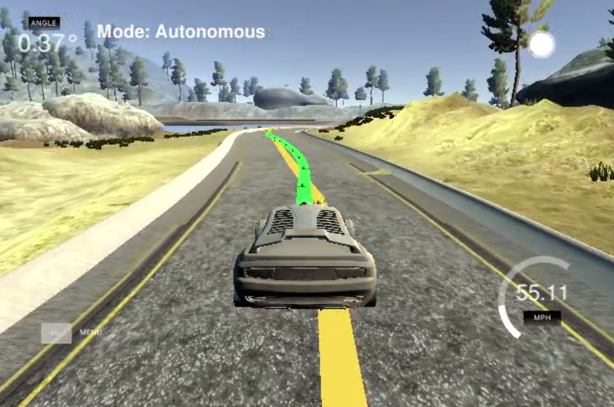

# Model Predictive Control



This project is in conjunction with the Udacity Self-Driving Car course.  In particular, the goal of this project is to implement a simple model predictive controller to safely throttle and steer a simulated car around a track. 

* More detail about the approach is provided in [writeup.md](./writeup.md).

## Getting Started

### Prerequisites

```
CMake
uWS		(Socket for interfacing with Udacity simulator)	
```

### Installing

1. Clone this project from GitHub:

```
git clone https://github.com/jimwatt/P10-MPController.git
```

2. Change into the `build` directory, and compile with `CMake`.

   ```
   cd build
   cmake ..
   make
   ```

## Running the Code

* Run the executable from the `build` directory:
  ```./mpc```
* The executable will wait until measurements are provided by the simulator through the uWS socket.


## Authors

* **James Watt**

<!--## License

This project is licensed under the MIT License - see the [LICENSE.md](LICENSE.md) file for details-->

## Acknowledgments
This project is a submission to the Udacity Self-Driving Car nanodegree:

* ```
  https://github.com/udacity/CarND-MPC-Control-Project.git
  ```

## Model Predictive Control

------

**Model Predictive Control of a Simulated Vehicle**

The goals / steps of this project are the following:

- Implement a Model Predictive Controller to provide steering and throttle controls for a simulated autonomous vehicle.  The vehicle must safely navigate itself around the track using measurements of the current state as input.

## [Rubric](https://review.udacity.com/#!/rubrics/513/view) Points

### 1. Compilation###

**Your Code Should Compile.**

- Done.  See compile instructions in the [README.md](README.md) file.

###2. Implementation###

**The Model**

- The state of the vehicle is given by:

  - $x$ : x-coordinate
  - $y$ : y-coordinate
  - $\psi$ : heading angle
  - $v$ : speed

- The actuator controls are:

  - $\delta$ : steering actuation
  - $a$ : throttle actuation

- The following kinematic model was used to model the vehicle and the effect of the steering and throttle actuators:

  $$\dot{x} = v \cos\psi$$

  $$\dot{y} = v \sin \psi $$

  $$\dot\psi = -\frac{v}{L_f} \cdot \delta$$

  $$\dot{v} =  a$$

  where $L_f$ is the distance from the axle through the steering wheels to the center of gravity.  

  In the Model Predictive Controller, the continuous model provided above was discretized in time so that the desired actuations could be computed at each time step in a finite-dimensional optimization.  

  The actuations were chosen to minimize the aggregated cross track error, the heading error, and the velocity error at each timestep along the predicted trajectory.

**Timestep Length and Elapsed Duration (N and dt)** 

I initially tried a long planning duration (4 seconds) sampled at high resolution (0.01 second sampling interval).  This resulted in N = 401, with a timestep length of 0.01.  My intuition was that the long planning horizon would allow the planner to negotiate turns at high speed by preparing well in advance.  Also, I felt that the high time resolution would allow for greater accuracy in the finite differencing approximation.

Unfortunately, I learned very quickly that this proved to be disastrous.  The ipopt solver required too long to solve resulting in significant delay and large oscillations and instability in the motion of the vehicle.  

I reduced the planning horizon to 1.8 seconds with a timestep of 0.2 seconds (N=10, dt=0.2 seconds).  This worked well, and allowed for sufficient planning and accuracy.

**Polynomial Fitting and MPC Preprocessing**

The desired waypoints were fit with a cubic polynomial.

The desired waypoints were first transformed into the body frame of the vehicle.

The polynomial coefficients were used to calculate the current cross track error and heading error.

Also, the current state of the vehicle was read from the socket messages.  The vehicle speed was converted from miles per hour to meters per second.of the 

**Model Predictive Control with Latency**

In order to deal with the 0.1 second latency (introduced by the thread::sleep command), I predicted the current state of the vehicle forward 0.1 seconds using the bicycle model.  This allowed the controller to optimize the actuator controls based on a more accurate estimate of the state of the vehicle when the actuations will actually be applied.  

I also measured delay introduced by the callback function (the Ipopt solve) to add this to the delay.  

### 3. Simulation

**The Vehicle Must Successfully Drive a Lap around the Track**

- Done.  The vehicle safely and smoothly navigates the track at a nominal speed of 60 miles per hour. See [./videos/mpc.mp4](./videos/mpc.mp4).

